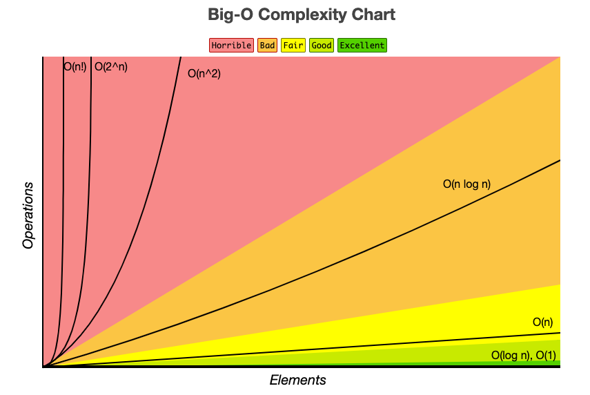
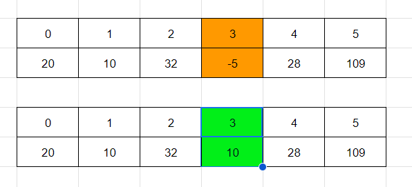
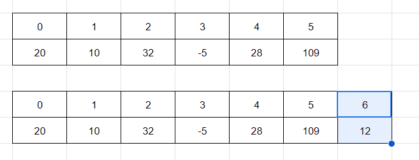
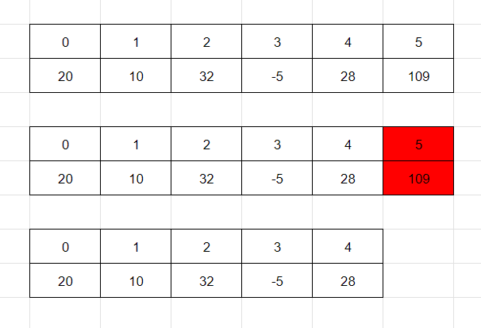
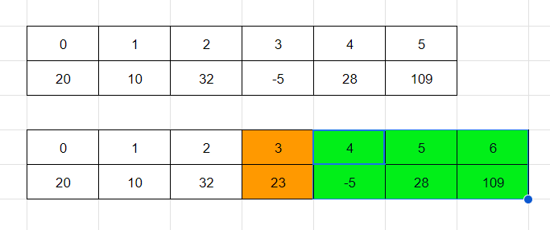
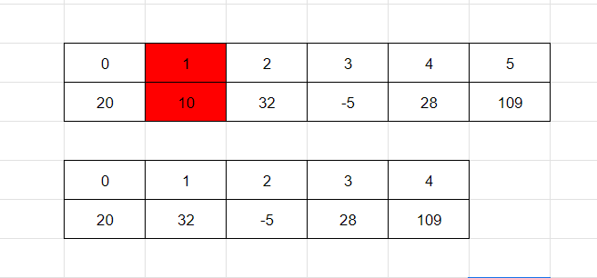

## 시간 복잡도

- 알고리즘의 실행 시간이 입력 크기에 따라 어떻게 변하는지를 수학적으로 표현
- 가장 일반적인 표기법인 빅오(Big O) 표기법을 사용
- 빅오 표기법은 최악의 경우의 실행 시간을 나타내며, 알고리즘의 성능을 비교하고 예측하는 데 유용

 

## 배열

- 같은 타입의 데이터를 메모리 상에 연속적으로 저장하는 자료구조
- O(1)에 특정 인덱스의 요소에 접근, 변경 가능
- 오버헤드가 적음
- 메모리 상에 연속한 구간을 잡아야해서 할당에 제약이 있음

### 임의의 위치에 있는 요소 접근 및 변경 (O(1))

### 요소를 끝에 추가 (O(1))

### 마지막 요소를 제거 (O(1))

### k번째 위치에 요소를 추가 (O(n))

### k번째 위치에 요소를 제거 (O(n))
